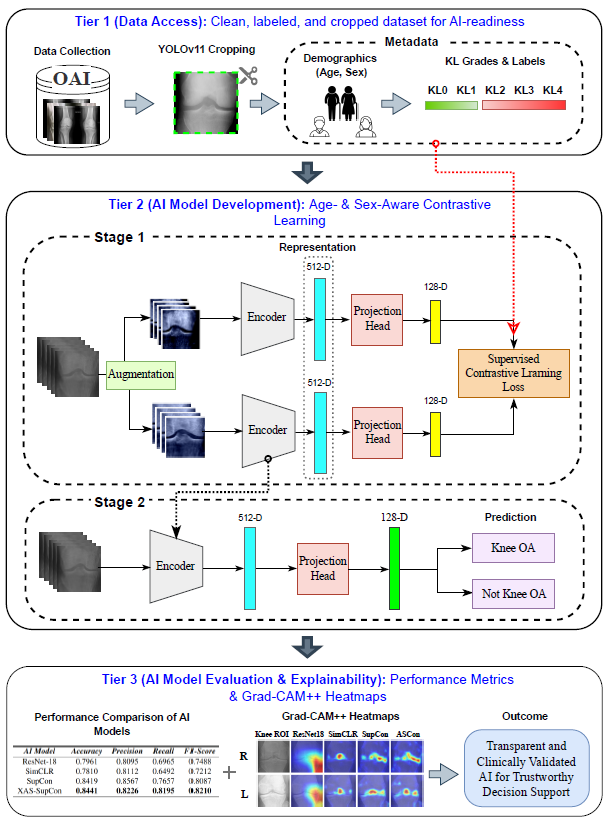

# ISBI-Supervised-Contrastive-Learning

## Table of Contents
- [Abstract](#abstract)
- [Directory Descriptions](#directory-descriptions)
- [The Proposed Computational Pipeline](#the-proposed-computational-pipeline)
- [The Osteoarthritis Initiative (OAI) Dataset](#the-osteoarthritis-initiative-oai-dataset)
- [Publications](#publications)
- [Acknowledgments](#acknowledgments)
- [Citation](#citation)

### Abstract

This GitHub repository contains all source codes, trained models, and visualization outputs associated with the research project entitled <strong>ASCon: Explainable Age- and Sex-Aware Contrastive Learning for KL Grading in Knee Osteoarthritis</strong>. The ASCon framework introduces a novel contrastive representation learning paradigm that incorporates demographic priors, age and sex, into the supervised contrastive loss to enhance fairness, robustness, and clinical interpretability. The model leverages cropped anteroposterior (AP) knee radiographs from the publicly available Osteoarthritis Initiative (OAI) dataset, processed using a YOLOv11-based pipeline. Through a two-stage architecture, (1) supervised contrastive representation learning and (2) linear classification, ASCon produces accurate, transparent, and demographically aware predictions of knee osteoarthritis severity. To ensure reproducibility and open scientific collaboration, this repository is freely available for research and educational purposes.

### Directory Descriptions
+ 
<strong>Code:</strong> This directory Contains all Python source codes for data preprocessing, model training, and evaluation (YOLOv11 detection, ASCon training, Grad-CAM++ visualization).

+ 
<strong>Dataset:</strong> This directory references the <a href="https://nda.nih.gov/oai" target="_blank">Osteoarthritis Initiative (OAI)</a> dataset used in this study. Due to data usage restrictions, raw radiographs and demographic data are not shared in this repository. Instructions for accessing the OAI dataset are provided within this directory. 

+ 
<strong>Figures:</strong> This directory includes all figures and visualizations generated for the study, including the computational pipeline, and Grad-CAM++ heatmaps illustrating anatomical explainability.

+ 
<strong>Models:</strong> This directory includes all AI models developed for this study.

+ 
<strong> Presentation:</strong> This directory contains presentation slides prepared for the ISBI 2026 presentation.

### The proposed computational pipeline

  
 
 The proposed <strong>ASCon</strong> (Age- and Sex-Aware Contrastive Learning) framework introduces a multimodal and explainable AI pipeline for automated and equitable knee osteoarthritis (KOA) assessment. The pipeline consists of three main tiers: 

<strong>Tier 1 (Data Preprocessing):</strong> YOLOv11 automatically detects and crops the knee region of interest (ROI) from the OAI dataset, followed by extraction of demographic metadata (age and sex) and KL grades.

<strong>Tier 2 (AI Model Development):</strong> Incorporates two stages: Stage 1 performs supervised contrastive representation learning using 512-D embeddings conditioned on demographic similarity, and Stage 2 trains a linear classifier for OA/Non-OA prediction.

<strong>Tier 3 (Evaluation and Explainability):</strong> Combines quantitative metrics (accuracy, precision, recall, and F1-score) with qualitative Grad-CAM++ heatmaps that highlight clinically relevant joint regions.
Together, these components establish a transparent and demographically aware AI framework for trustworthy KOA diagnosis.

### The Osteoarthritis Initiative (OAI) Dataset

The authors thank the <a href="https://nda.nih.gov/oai" target="_blank"> Osteoarthritis Initiative (OAI)</a> for the datasets utilized in this research contribution.

### Publications

Fengyi Gao, Farnaz Rezvani, Michael Kann, Nickolas Littlefield,
Hilal Maradit Kremers, Adolph J. Yates, Johannes F. Plate, and Ahmad P. Tafti.
 
<em>Explainable Age- and Sex-Aware Contrastive Artificial Intelligence for Knee Osteoarthritis Classification.</em>
 

<strong>Manuscript submitted to the International Symposium on Biomedical Imaging (ISBI), 2026.</strong>

### Acknowledgements

The authors thank the 
<a href="https://nda.nih.gov/oai" target="_blank">Osteoarthritis Initiative (OAI)</a> 
for providing the imaging and clinical datasets utilized in this research contribution. 

### Citation:

This contribution is fully described in our manuscript entitled 
"<i>Explainable Age- and Sex-Aware Contrastive Artificial Intelligence for Knee Osteoarthritis Classification</i>", 
which is currently under review for presentation at the 
<a href="https://biomedicalimaging.org/2026/" target="_blank">International Symposium on Biomedical Imaging (ISBI) 2026</a>. 
Any publication or use of this work should cite this manuscript accordingly.

   
  <b>Pitt Health + Explainable AI (Pitt HexAI) Research Laboratory</b>

